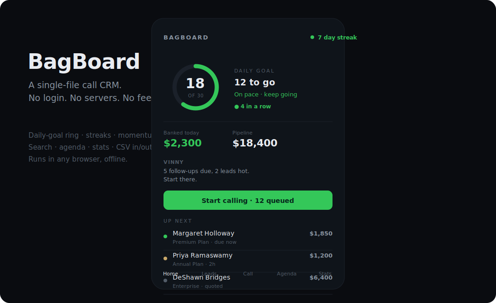

<div align="center">

# BagBoard

**A single-file call CRM. No login, no servers, no monthly fees.**
Your leads live in your own browser; you dial them from your own phone.

[](https://github.com/JAMMx2/bagboard/releases/latest)
[](LICENSE)




</div>

## Run it from your terminal (copy-paste)

One command downloads BagBoard and gets it running — nothing to install.

**Windows** (PowerShell) — downloads it and starts the local server at http://localhost:8753:

```powershell
$d="$env:USERPROFILE\BagBoard"; ni $d -ItemType Directory -Force | Out-Null; irm https://raw.githubusercontent.com/JAMMx2/bagboard/main/index.html -OutFile "$d\index.html"; irm https://raw.githubusercontent.com/JAMMx2/bagboard/main/server.ps1 -OutFile "$d\server.ps1"; powershell -NoProfile -ExecutionPolicy Bypass -File "$d\server.ps1"
```

It installs to `%USERPROFILE%\BagBoard`, opens your browser at **http://localhost:8753**, and asks about Wi-Fi sharing — press **Enter** for private, or **Y** to dial from your phone. Keep the window open while you work; re-run any time with `powershell -ExecutionPolicy Bypass -File "$env:USERPROFILE\BagBoard\server.ps1"`.

**macOS / Linux** (Terminal) — downloads it and serves it locally:

```bash
d=~/bagboard; mkdir -p "$d" && curl -fsSL https://raw.githubusercontent.com/JAMMx2/bagboard/main/index.html -o "$d/index.html" && cd "$d" && python3 -m http.server 8753 --bind 127.0.0.1
```

Then open **http://localhost:8753**. Drop `--bind 127.0.0.1` to let phones on the same Wi-Fi open it too.

<details>
<summary><b>Just want the app file (no server)?</b></summary>

Download `index.html` and open it in any browser — the whole app, offline, no server:

```powershell
irm https://raw.githubusercontent.com/JAMMx2/bagboard/main/index.html -OutFile "$HOME\Desktop\BagBoard.html"; ii "$HOME\Desktop\BagBoard.html"
```

macOS / Linux: `curl -fsSL https://raw.githubusercontent.com/JAMMx2/bagboard/main/index.html -o ~/BagBoard.html && (open ~/BagBoard.html || xdg-open ~/BagBoard.html)`
</details>

## Get it running — one double-click

**Windows (easiest):** download **[`BagBoard.bat`](https://github.com/JAMMx2/bagboard/releases/latest/download/BagBoard.bat)** and **double-click it**. That's the whole setup — it launches and opens in your browser. No unzip, no install, no admin. *(If Windows shows a "protected your PC" box the first time, click **More info -> Run anyway**.)*

**Any computer or phone:** download **[index.html](https://github.com/JAMMx2/bagboard/raw/main/index.html)** and open it in any browser — that's the entire app.

**Whole project (developers):** grab **[the latest release](https://github.com/JAMMx2/bagboard/releases/latest)** (`bagboard.zip`) or clone the repo. `SETUP-GUIDE.md` has step-by-step instructions.

> First thing in the app: open **Settings**, set your name, then **Add** or **Import** your leads.

**Run it on your computer *and* phone (optional):** launched via `BagBoard.bat` / `server.ps1` it keeps your leads in a small database on your PC. Type **Y** at startup to share on Wi-Fi, then open the shown address on your phone — you dial the **same live list** from your phone (your own number, a normal call) and every outcome syncs back. Private by default; the shared endpoint is token-gated, so use a network you trust.

## What it does
- Lines up who to call next and walks you through them one at a time — number, outcome, next.
- Full pipeline: New -> Contacted -> Callback -> Appt -> Quoted -> Closed, with follow-ups scheduled for you.
- Hand-dial friendly: tap-to-call on a phone; on a computer it copies the number to dial by hand and copies a ready-to-send follow-up text.
- **Rapid Dial** mode: blitz a whole list — big number, tap to copy, Spacebar to advance, keys 1-5 to log an outcome, and optional hands-free auto-advance.
- **Use it on your phone**: turn on Wi-Fi sharing and open BagBoard on your phone (same network) to dial numbers straight from there.
- Search, sort, filter, multi-select, de-dupe. An agenda of what's due. Stats: contact/appointment rates, a 7-day chart, pipeline, and personal bests.
- Stays motivating — a daily-goal ring, streaks, in-session momentum, and subtle (toggleable) sound cues.
- CSV import/export and one-click local backup. **Nothing ever leaves your machine.**

## Your data & privacy
Everything is stored in your browser's `localStorage` on the device you use — no accounts, no network calls, no tracking. Clearing your browser wipes it, so use **Settings -> Download backup** now and then. See [SECURITY.md](SECURITY.md) and the [security audit](AUDIT.md).

## Dial from your phone (pair it)
Launch BagBoard with **BagBoard.bat** (or `server.ps1`) and type **Y** at "Share on your Wi-Fi?". It prints an address like `http://192.168.1.20:8753`. Open that on your phone (same Wi-Fi) and:

- You dial the **same leads** as the computer — tap a number and your phone places the call with **your own number** (no VoIP, no fees).
- Outcomes you log on the phone **sync back** to the computer, and vice-versa. The host PC holds the shared database (`BagBoard-data.json` in your user folder), so your list also survives a browser-cache wipe.
- Tap Share → **Add to Home Screen** so it opens like an app.

**Standalone mode still works:** open `index.html` as a plain file and it's the original offline, per-device app (localStorage, no sync).

**On security:** sharing exposes a token-gated `/api/state` endpoint on your LAN — a device on that network with the link can read/write the leads. Use a **trusted** network (home/office), keep it **private** (the default) on public/guest Wi-Fi, and back up regularly. See [SECURITY.md](SECURITY.md).

Want the same list across *different* networks (home ↔ office, no shared Wi-Fi)? That's the cloud/Drive path — open an issue.

## Contributing
It's intentionally one file of vanilla HTML/CSS/JS — no build step, no dependencies. See [CONTRIBUTING.md](CONTRIBUTING.md).

## License
[MIT](LICENSE) — do what you want with it. (c) 2026 BagBoard contributors
